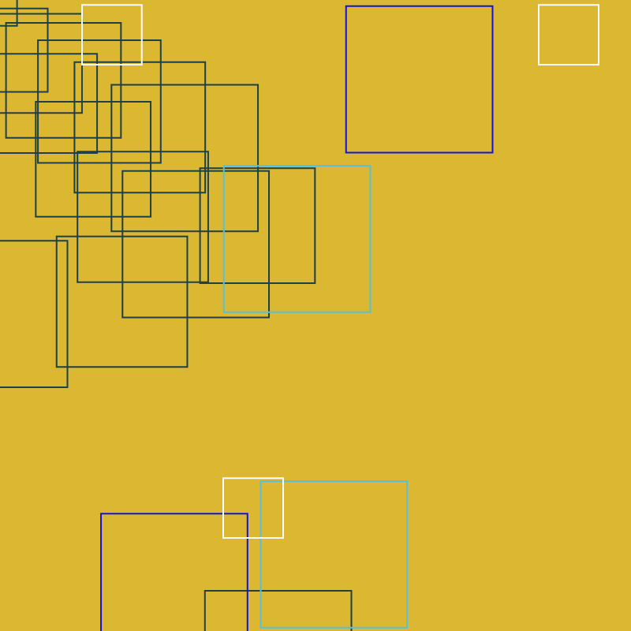
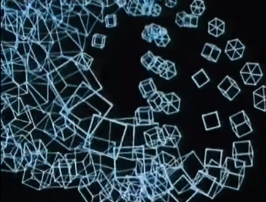
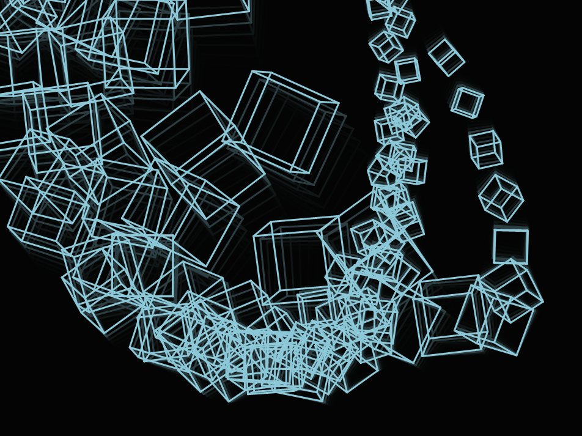
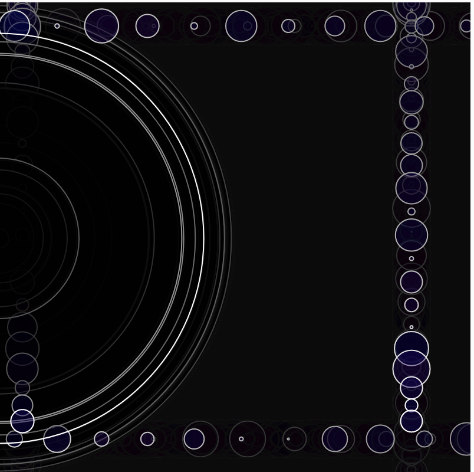
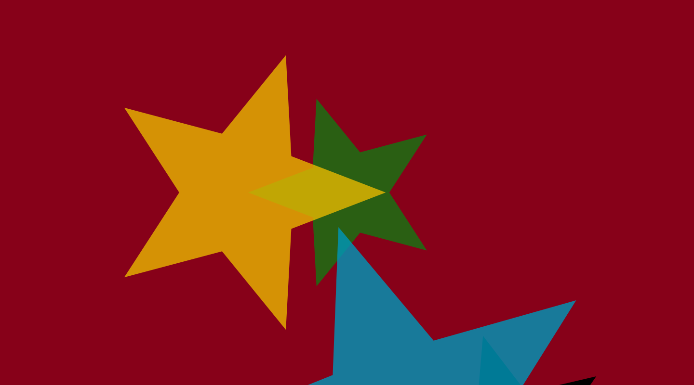
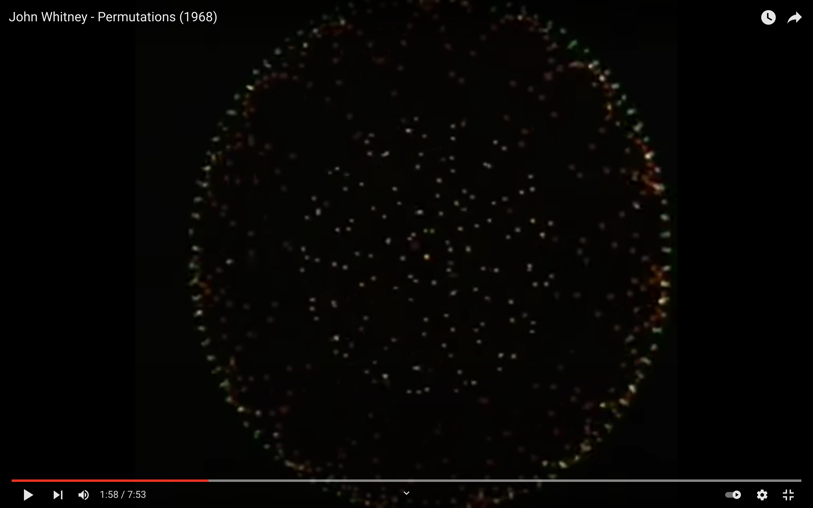
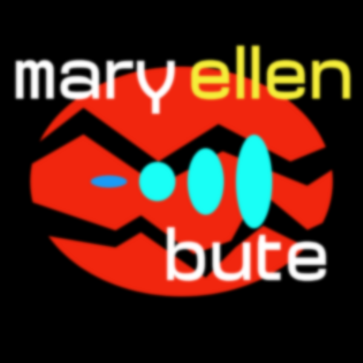
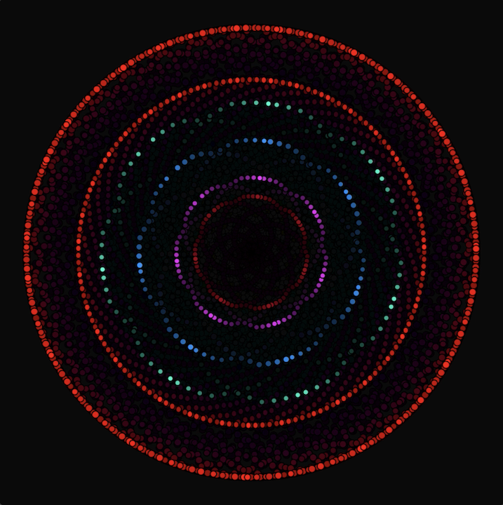
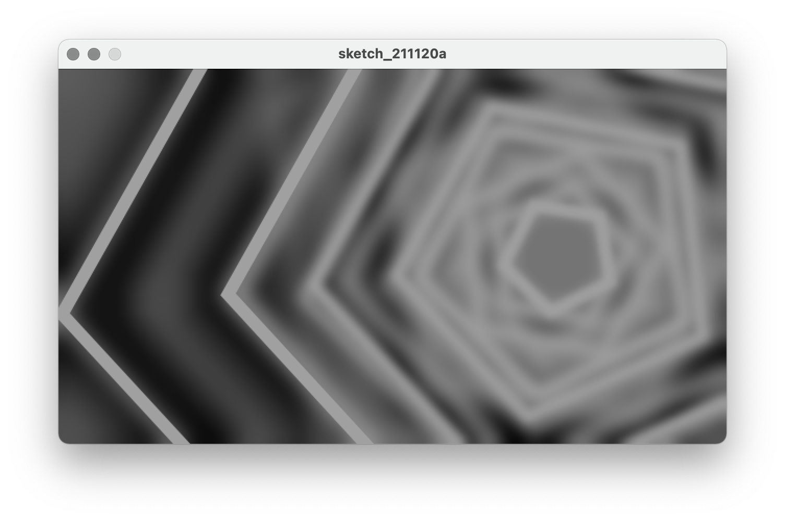
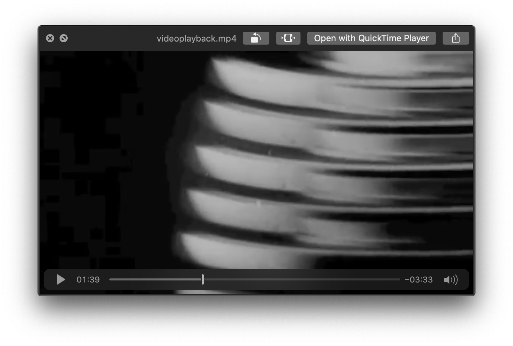

# HW_ Week 2

## Lillian B:

[Inspired by John Whitney’s Matrix (1971)](https://editor.p5js.org/lllyyybbb/sketches/zQg_FMtgY); [Process Notes](https://raw.githubusercontent.com/lllyyybbb/SFPC-Recreating-the-Past-2021/main/Week%202%3A%20John%20Whitney/ProcessNotes.txt)

Recreation:

## Matthis G:

I also chose to recreate a section of John Whitney’s ‘Matrix’ film. In the final few seconds there is a waterfall of cubes that appear to curl like a breaking wave. I’ve been exploring 3D projection + rotation recently so I thought it would be a good challenge. Getting the particular variations in angle of orbit was difficult and I’m not quite satisfied with what I ended up with.  In the film, the cubes also seem to slow down as they get ‘closer’, but in my repro they get faster instead.  
There will always be something!

[Live version](https://www.matthisgrunsky.ca/rtp/week2_whitney/repro.html) / [With code](https://editor.p5js.org/codingsketchbook/sketches/TyUBVpeOl)

Original:

Recreation:

## Salem A:

From John Whitney’s Catalog (1961)

[Original](https://youtu.be/TbV7loKp69s?t=305) (starts at around 5:05)

[Recreation](https://roamresearch.com/#/app/salem-public-graph/page/grS4B7W1L) (including process and code)

[Video](../media/witney_2.mp4?dl=0)

## Hiroyuki:

All of John Whitney's videos are wonderful and I spent a lot of time looking at them. It was very difficult to choose which parts to recreation. The last part of Matrix III turned out to be an ∞ trajectory. Using of for the first time was also a challenge, but I regret that I forgot to record the process because I could not figure out how to export the video.

[github](https://github.com/hiroyukisakamoto/rtp_sfpc_fall21/tree/master/w02_johnwhiteney)
[Preview](https://hiroyukisakamoto.github.io/rtp_sfpc_fall21/w02_johnwhiteney/bin/w2_johnwhiteney.html)

I couldn't figure out how to change from a line to a sphere like in the original video. I would also like to try to find a way to gradually slow down or speed up the speed of the line.

[John Whitney, Matrix III (1972)](https://www.youtube.com/watch?v=ZrKgyY5aDvA)

Original:

[Video](../media/John Whitney Matrix III 1972.mp4)

Recreation:

[Video](../media/recreation.mp4)

https://www.youtube.com/watch?v=1ssE0V7bUIU

https://www.youtube.com/watch?v=KmsHUro2WYk

## Ladan B:

John Whitney’s [Arabesque](https://www.youtube.com/watch?v=sQrq7S0dP54&t=51s)

My piece is inspired by John Whitney’s work but it’s definitely not an exact recreation. Still work in progress.

https://editor.p5js.org/lbahmani/sketches/x1iJcBYdF

Original:

Recreation:

## Maya C:

 [**RECREATING MARY ELLEN BUTE**](https://mimiworks.tumblr.com/post/667382451782483969/recreating-mary-ellen-bute)

Recreation:

https://editor.p5js.org/charm006/full/uN3_Q9RX-

## Jenna M:

**John Whitney Permutations Study** (Starting at around 1:50)

Original:

Recreation:

[Recreation Study Video](https://vimeo.com/643959347) | [Original Video](https://youtu.be/kdYxJ85RSds?t=110) | [Process Study Video](https://vimeo.com/643982387)

## Thomas B:

**Recreating John Whitney’s Matrix III**

[Original](../media/matrix iii.mp4)

[Recreation](../media/recreating matrix iii.mp4)

## Hermann Z:

Inspired by John Whitney "Catalog" 1961

https://observablehq.com/d/70da88f434d04097

## Kate Y:

https://www.youtube.com/watch?v=Wp_BaQ0YGwI&

[https://youtu.be/Wp_BaQ0YGwI](https://youtu.be/Wp_BaQ0YGwI). (new version, sound starts earlier & a few other tweaks)

I was inspired by the idea of visual music, with rhythm, pattern and movement of shapes and colors evoking an internal experience similar to the abstraction of a musical experience. This is analogue (shot on my iPhone 6) so I added titles coded in Snap
I chose the spinner because it creates sine waves with movement like a musical rhythm. The music has a breathy quality which is echoed in the back & forth of the ribbon movement. The multiple stripes move together but not identically, allowing for a fluid but strong visual rhythm. The shiny ribbon is reflective enough that I was able to shoot it in very low light

## Sara M:

**Reenactment and process**

At first, I wanted to understand what reenactment meant for me - I explored the idea of understanding the technology I have available today and how to use it in an expressive way, which is what I find intriguing about Mary Ellen Bute and John Whitney. On the other hand, both seemed to connect the mathematical patterns of the harmonic scale, somehow translating the language of music to the visual language.

I was very intrigued by the idea of connecting a piece to a visual element and seeing the kind of patterns it could create, it seemed like an experiment of painting through music composition. I didn’t end up doing it because I was short on time and didn’t feel like I could explore this idea in a week, but I’ll share the process of how I thought I might do it (and maybe will with more time and dedication):

1. John Whitney describes making music through an oscillator and simultaneously making visuals through light with an instrument he made with his brother (Moving Pictures and Electronic Music, 1959). He describes the mechanism of a pendulum having a range of four octaves with a base frequency of one second. The speed at which it would move would be responsible for creating the frequency waves throughout the four octaves. The speed can be controlled through the pendulum’s weight, which in turn controls the output, which is frequency.
2. To do this with code, I would establish at least three different graphic elements (say a = circle, b = triangle and c = square). To mimic the harmonic scale’s structure, I would set a differential speed for each element (so a moves at a speed of 1 sec, b moves at a speed of 2(1 sec) and c moves at a speed of 3(1 sec))
3. To continue speaking through the language of music, I would make these three elements move in a different direction. If I’m trying to speak the language of counterpoint, I would have to abide by some rules of which direction it could go to in relation to the other. If I’m trying to play some Pauline Oliveiros then I would create a piece accordingly, probably live.
4. From John Whitney: “So long as elements obey a rule of direction and rate, pattern configurations form and reform. This is harmonic resonance”. The result would be to see how musical language can also paint.

So, this week I wasn’t able to go from theory to practice. I still made [this](https://editor.p5js.org/identikitten/sketches/jRdB5iIRX) in P5.js as a tribute to Mary Ellen Bute, from her piece [Tarantella](https://www.youtube.com/watch?v=czDsy8BYP1M&t=57s) (see min. 2:33).  It was a lot of fun to animate through code and experiment with changing colors progressively.

## Mau.

Permutations / John Whitney.
code: https://editor.p5js.org/mau/sketches/1sVYdey9w

Original:

Recreated:

## Sara K:

**Mary Ellen Bute**

I was captivated by Bute’s work, especially her film “SYNCHROMY N°2 - O EVENING STAR”. I could immediately see the glass reflections and how she “reenacted” that to expand the image through refraction. I appreciated the motion too that I paid no attention to music. I am not easily taken by music or sound and I actually found myself repeating some of the scenes multiple times and watching them in different speeds ignoring the fact that I disturbed the music (I am aware that I wasn’t faithful to Bute’s at this point…). This gave some glimpses on how I would translate that into code. I could think of the abstractions to use, general shapes, what kind of interactions I wish to make. However, I was set back by my own inadequacy in coding, but I believe I will revisit this assignment sometime again.

Original (shot from a video):

Recreation (interactive):

[Process](https://marsh-decimal-511.notion.site/RTP-HW2-v2-c9f7023d10a1471eb183500b3aee984e) ;

Original (shot from a video):

Recreation (interactive):

[Process](https://marsh-decimal-511.notion.site/RTP-HW2-v1-a64fc85effed495c89b73130a1f3e76a) ;
